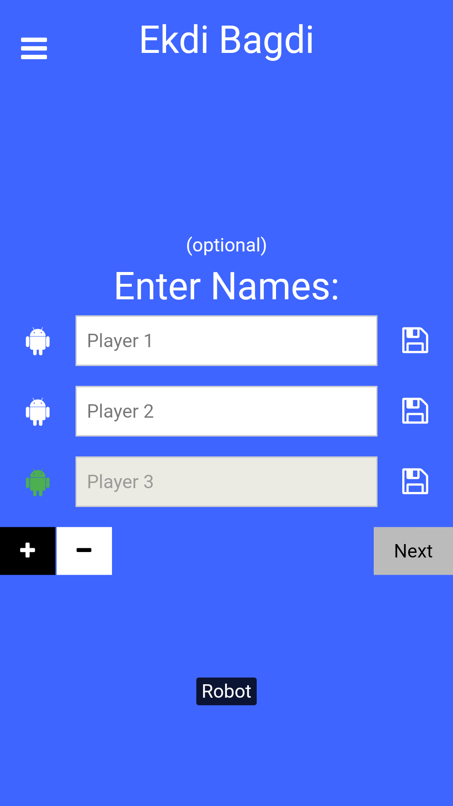
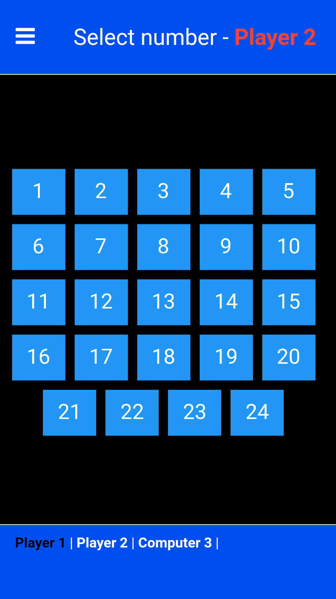
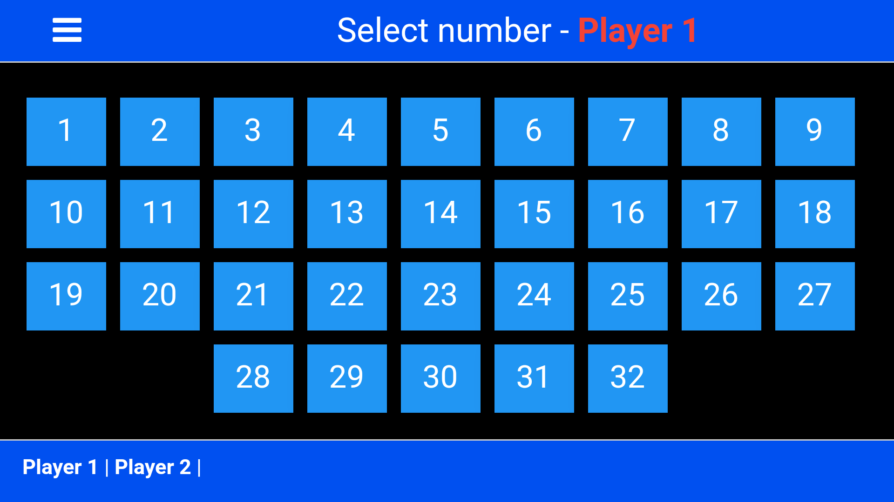
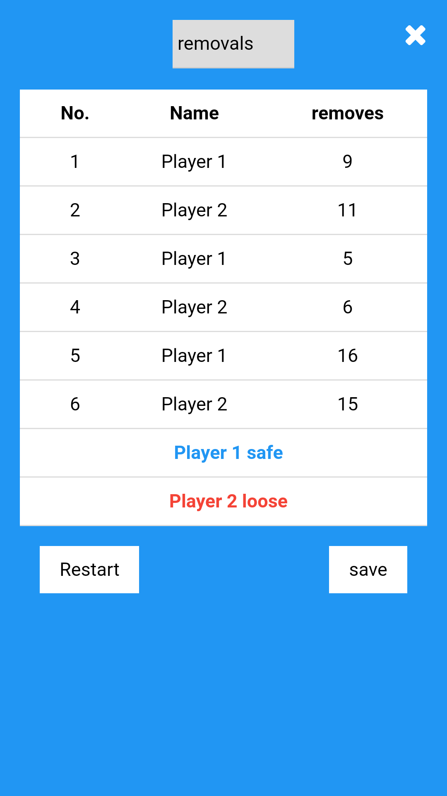

# Number Chance Game

This project, created during my school days in 2017 is a fun and engaging game based on numbers and chance. This project was built using HTML, CSS, JavaScript, and JQuery. The Android app version utilizes WebView, Javascript Interface, and Google Ads. Originally published on the Play Store, it's now available on GitHub to showcase in my portfolio.

Play here: https://aditya4447.github.io/EkdiBagdi

## How to Play

### Step 1: Start the Game

1. **Add Players**: Minimum of two players required. If you are playing alone, click the icon before the player name to make it a robot.
2. **Select Range**: The default range is set, but you can increase it to make the game more interesting. Note that a larger range will make the game take more time.
3. **Select Numbers**: Each player secretly selects a number within the range and remembers it. The player's turn will be indicated in the top bar.
4. **Remember Selected Number**: It is crucial to remember the number you selected.

### Step 2: Main Gameplay

1. **Remove Numbers**: After all players have selected their numbers, the game progresses to the main part where players take turns to remove numbers.
2. **Guess and Remove**: During their turn, a player must guess the numbers chosen by other players and try to remove a number that has NOT been selected by anyone else.
3. **Avoid Own Number**: Players must avoid removing their own number, as this will result in losing the game.
4. **Safe Players**: Players whose numbers are guessed and removed by others are safe.
5. **Last Player**: The last remaining player with a number not guessed correctly loses the game. If a number is selected by more than one player and is not removed, the game ends in a draw.

## Tech Stack

- **Frontend:** HTML, CSS, JavaScript, JQuery
- **Android App:** WebView, Javascript Interface, Google Ads

## Screenshots

### Game Setup

### Main Gameplay

### Selection Table

